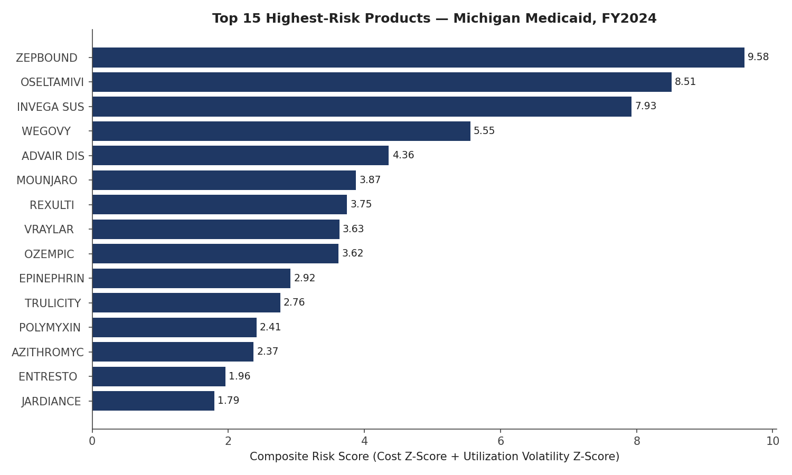

# Medicaid Pharmacy Analytics Portfolio

Two independent projects demonstrating pharmacy claims analysis and business-analyst skills applied to Medicaid pharmacy programs — built to reflect the actual work of a pharmacy claims auditor / business analyst, not generic tutorial exercises.

**Author:** Crystal Greer, PTCB Certified Pharmacy Technician
**Repo:** [github.com/cgreer90/medicaid-pharmacy-analytics-portfolio](https://github.com/cgreer90/medicaid-pharmacy-analytics-portfolio)

## Projects

### 1. [Michigan Medicaid Pharmacy Claims — Risk-Based Audit Sample Selection](medicaid-pharmacy-analytics-portfolio/project-1-audit-risk-model/)

Analyzes 131,000+ real Michigan Medicaid pharmacy claims (CMS public data, FY2024) to build a formula-driven risk-scoring model that flags claims with the highest likelihood of billing errors — prioritizing audit review instead of reviewing claims at random.

**Key finding:** the flagged sample (top 30 of 200 products reviewed) represented approximately 70% of total dollars in the audit universe.

**Skills demonstrated:** claims data analysis, statistical outlier detection, Excel formula modeling (SUMIFS, INDEX/MATCH, RANK), Python/pandas, data visualization, audit methodology documentation.

[→ Full project details](medicaid-pharmacy-analytics-portfolio/project-1-audit-risk-model/)

### 2. [Prior Authorization Rule Design — Requirements, Test Cases & Defect Log](medicaid-pharmacy-analytics-portfolio/project-2-pa-rule-requirements/)

Simulates the full business-analyst lifecycle for a new Medicaid pharmacy prior authorization rule (GLP-1 weight-management drugs): a formal Business Requirements Document, a 25-scenario formula-driven test case matrix (positive, negative, and edge cases), and a defect log documenting 3 issues surfaced during testing with root-cause analysis and recommended resolutions.

**Skills demonstrated:** requirements documentation, test case design, UAT methodology, defect tracking, Excel formula logic modeling.

[→ Full project details](medicaid-pharmacy-analytics-portfolio/project-2-pa-rule-requirements/)

## Why these two together

Project 1 demonstrates the ability to analyze existing claims data and identify risk patterns. Project 2 demonstrates the ability to define a new business rule and prove a system implements it correctly. Together they cover both halves of a pharmacy claims/business analyst role: analyzing what already happened, and specifying and validating what should happen next.

## Repository Structure
medicaid-pharmacy-analytics-portfolio/
├── README.md ← this file
├── project-1-audit-risk-model/
│ ├── README.md
│ ├── data/ ← raw CMS claims data
│ ├── scripts/ ← Python build scripts
│ ├── output/ ← Excel workbook + methodology PDF
│ └── visuals/ ← chart images
└── project-2-pa-rule-requirements/
├── README.md
├── build_test_matrix.py
├── build_defect_log.py
└── output/ ← BRD + test case/defect log workbook

## Tools Used

Python (pandas, openpyxl, matplotlib), Excel (SUMIFS, INDEX/MATCH, RANK, IF/AND logic, statistical formulas), CMS public data.

## Limitations

Both projects use publicly available or synthetic data for demonstration purposes — neither is a substitute for real claim-level audit or production system access. See each project's individual README for details.
