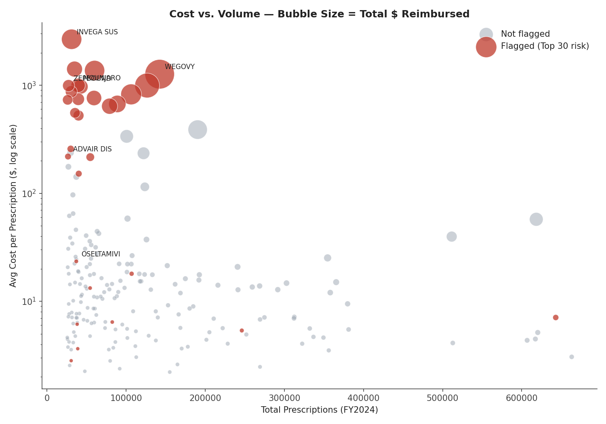
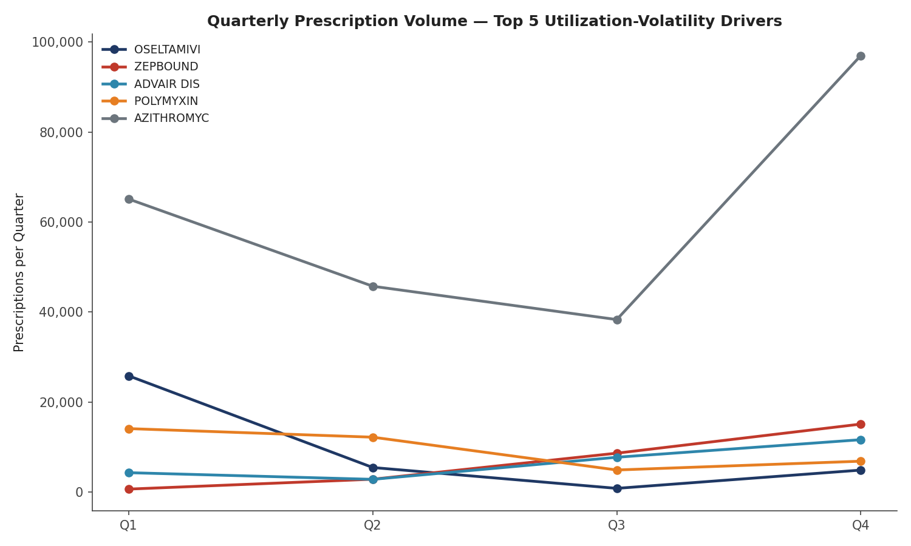
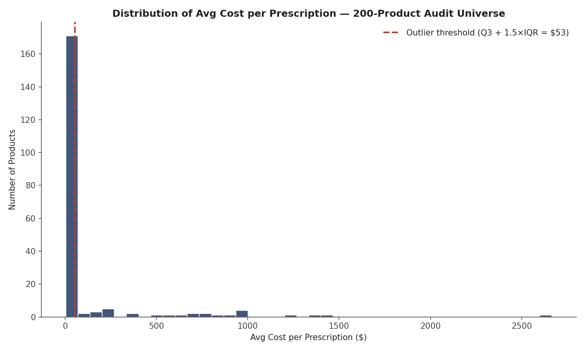

# Michigan Medicaid Pharmacy Claims — Risk-Based Audit Sample Selection

A data-driven audit sample selection model built on real, publicly available CMS Medicaid claims data — designed to identify which pharmacy claims carry the highest risk of billing irregularities and prioritize them for audit review, rather than reviewing claims at random.

**Author:** Crystal Greer, PTCB Certified Pharmacy Technician
**Data source:** [CMS State Drug Utilization Data (SDUD)](https://data.medicaid.gov/dataset/61729e5a-7aa8-448c-8903-ba3e0cd0ea3c), Michigan, FY2024 (Q1–Q4)

## Objective

Identify pharmacy claims within Michigan's 2024 Medicaid drug utilization data that carry the highest risk of billing irregularities or non-compliance, and prioritize them for audit review — mirroring the core function of a pharmacy claims auditor: researching and selecting audit samples based on risk indicators rather than reviewing claims at random.

## Data & Scope

The full Michigan SDUD file for FY2024 contains **131,357 claim-line records** across both fee-for-service (FFSU) and managed-care (MCOU) utilization, spanning 2,988 distinct drug products. The audit universe was scoped to the **200 highest-volume products by total prescription count** for the year — the drugs most likely to drive material dollar impact if billing errors exist.

## Methodology

Two independent risk indicators were calculated for each of the 200 products, directly from the claims data:

- **Cost Outlier Score** — average reimbursement per prescription, standardized as a z-score against the 200-product cohort. A high positive score flags a drug being reimbursed at an unusually high rate relative to its peers.
- **Utilization Volatility Score** — the swing between each product's highest and lowest quarter of prescription volume in 2024 (relative to its average), also standardized as a z-score. A high score flags erratic quarter-over-quarter utilization.

The two z-scores were summed into a composite **Risk Score**, and all 200 products were ranked. The **top 30 highest-ranked products** form the recommended audit sample.

All calculations in the accompanying workbook are **live Excel formulas** referencing the raw claims data — nothing is hardcoded, so the model recalculates automatically if the underlying data changes.

## Key Findings


- The **30 flagged products** — 15% of the 200-product audit universe — account for approximately **70% of total dollars reimbursed** within that universe, meaning the risk model concentrates audit effort on a small set of claims with outsized financial exposure.



- Cost-outlier drivers were concentrated among high-cost specialty drugs (e.g., long-acting injectable antipsychotics, GLP-1 weight-management medications), consistent with known categories of Medicaid drug spend growth in 2024.



- Utilization-volatility drivers included a mix of seasonal medications (predictable seasonal demand swings) and rapidly-adopted newer therapies — both flagged, but warranting different audit approaches.



- The cost-per-prescription distribution is heavily right-skewed, as expected in pharmacy claims data; the IQR-based outlier threshold (Q3 + 1.5×IQR) cleanly separates a small number of high-cost drugs from the bulk of the audit universe.

## Repository Structure

```
mi-medicaid-audit-risk-model/
├── README.md
├── data/
│   └── mi_sdud_2024_raw.csv          # Full raw claims data (131,357 rows)
├── scripts/
│   ├── build_risk_scoring.py         # Builds the Risk Scoring sheet (formulas)
│   ├── build_dashboard.py            # Builds Audit Sample + Dashboard sheets
│   └── build_visuals.py              # Generates the charts in this README
├── output/
│   ├── MI_Medicaid_Audit_Workbook.xlsx    # Full interactive workbook
│   └── MI_Medicaid_Audit_Methodology.pdf  # One-page methodology summary
└── visuals/
    └── *.png                         # Chart images used in this README
```

## Deliverables

- **[MI_Medicaid_Audit_Workbook.xlsx](output/MI_Medicaid_Audit_Workbook.xlsx)** — four linked tabs: raw claims data, formula-driven risk scoring, the high-risk audit sample, and a summary dashboard.
- **[MI_Medicaid_Audit_Methodology.pdf](output/MI_Medicaid_Audit_Methodology.pdf)** — one-page write-up of the methodology and findings.

## Limitations

This is a claims-line risk-scoring exercise using publicly available aggregate CMS data, not a substitute for pharmacy-level or claim-level audit investigation, which would require access to individual claim documentation, prescriber and pharmacy identifiers, and contractual/regulatory reference data not present in the public SDUD file. It is intended to demonstrate a defensible, data-driven approach to audit sample prioritization.

## Tools Used

Python (pandas, openpyxl, matplotlib), Excel (SUMIFS, INDEX/MATCH, RANK, statistical formulas), CMS public data.
